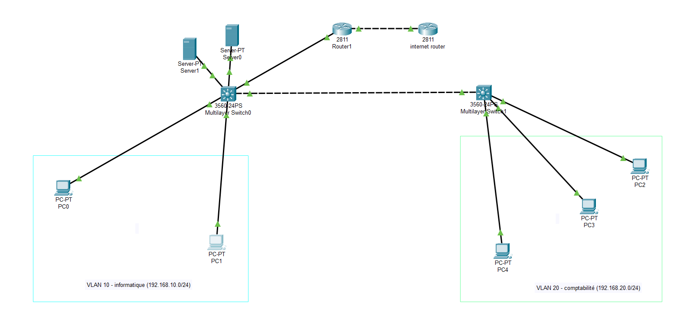

# Cisco VLAN & Inter-VLAN Routing Project

**Built from scratch using Cisco Packet Tracer — implementing VLANs, Inter-VLAN routing, DNS, and Web Server (HTTP) functionality.**

---

## Overview

This project demonstrates the configuration of multiple VLANs, inter-VLAN routing using **Router-on-a-Stick**, static IP addressing, DNS resolution, and web access testing through an HTTP server — all built and tested in **Cisco Packet Tracer**.

---

## Objectives

- Configure VLANs and assign devices to each VLAN.
- Enable inter-VLAN routing using a single router interface with subinterfaces.
- Set up a **DNS Server** for hostname resolution.
- Add a **Web Server (HTTP)** to serve web content accessible via DNS name (`www`).
- Verify end-to-end connectivity between VLANs and services.

---

## Device List

| Device Name | Function | Interface | IP Address | VLAN | Notes |
|--------------|-----------|------------|-------------|-------|--------|
| **Router1** | Inter-VLAN Routing (Router-on-a-Stick) | G0/0.10<br>G0/0.20 | 192.168.10.1<br>192.168.20.1 | 10<br>20 | Default gateway for all VLANs |
| **Switch0** | Access Switch | VLAN Interfaces | - | 10, 20 | Connects PCs and Servers |
| **Switch1** | Distribution Switch | Trunk Port | - | 10, 20 | Connects to Router1 and Switch0 |
| **PC1** | Client | Fa0 | 192.168.10.10 | 10 | Test device (VLAN10) |
| **PC2** | Client | Fa0 | 192.168.20.10 | 20 | Test device (VLAN20) |
| **Server0** | DNS Server | Fa0 | 192.168.10.50 | 10 | Provides DNS name resolution |
| **Server1** | Web Server (HTTP) | Fa0 | 192.168.10.60 | 10 | Hosts the `www` webpage for VLANs |
---

## Configuration Summary

### VLAN Configuration (on both switches)
```bash
Switch(config)# vlan 10
Switch(config-vlan)# name VLAN10
Switch(config)# vlan 20
Switch(config-vlan)# name VLAN20

Switch(config)# interface range fa0/1 - 4
Switch(config-if-range)# switchport mode access
Switch(config-if-range)# switchport access vlan 10

Switch(config)# interface range fa0/5 - 8
Switch(config-if-range)# switchport mode access
Switch(config-if-range)# switchport access vlan 20
```

### Trunk Link Configuration
```bash
Switch(config)# interface g0/1
Switch(config-if)# switchport mode trunk
Switch(config-if)# switchport trunk allowed vlan 10,20
```

### Router Configuration (Router-on-a-Stick)
```bash
Router(config)# interface g0/0.10
Router(config-subif)# encapsulation dot1Q 10
Router(config-subif)# ip address 192.168.10.1 255.255.255.0

Router(config)# interface g0/0.20
Router(config-subif)# encapsulation dot1Q 20
Router(config-subif)# ip address 192.168.20.1 255.255.255.0
```

---

## DNS Server Configuration

| Setting | Value |
|----------|--------|
| IP Address | 192.168.10.50 |
| Default Gateway | 192.168.10.1 |
| DNS Record | `www` → `192.168.10.60` (Web Server) |

Verification from any PC (VLAN10 or VLAN20):
```bash
C:\> nslookup www
Server:  192.168.10.50
Address: 192.168.10.50

Non-authoritative answer:
Name:    www
Address: 192.168.10.60
```

---

## 💻 HTTP Server Configuration

| Setting | Value |
|----------|--------|
| IP Address | 192.168.10.60 |
| Default Gateway | 192.168.10.1 |
| Web Service | Enabled (HTTP) |
| Test Page | "Welcome to My VLAN Project Web Server
Everything is working perfectly!" |

Verification:
```bash
C:\> ping www
C:\> start www
```
→ Opens the test webpage in Cisco Packet Tracer’s web browser.

---

## Testing & Verification

| Test | Expected Result |
|------|------------------|
| `ping` between VLAN10 and VLAN20 | ✅ Successful |
| DNS name resolution (`nslookup www`) | ✅ Successful |
| Web access (`start www`) | ✅ Opens webpage |
| Trunk link status | ✅ Active |
| Router subinterfaces | ✅ Operational |

---

## Project Diagram

---

## Files Included

- [`VLAN_internet.pkt`](./VLAN_internet.pkt) → Main project file  
- [`README.md`](./README.md) → Short overview  
- [`README_detailed.md`](./README_detailed.md) → Full documentation  
- [`/screenshots/`](./screenshots) → Contains topology and testing screenshots


---

## Summary

A fully functional multi-VLAN network with router-on-a-stick inter-VLAN routing, DNS-based hostname resolution, and web server access — built entirely from scratch in **Cisco Packet Tracer**.
